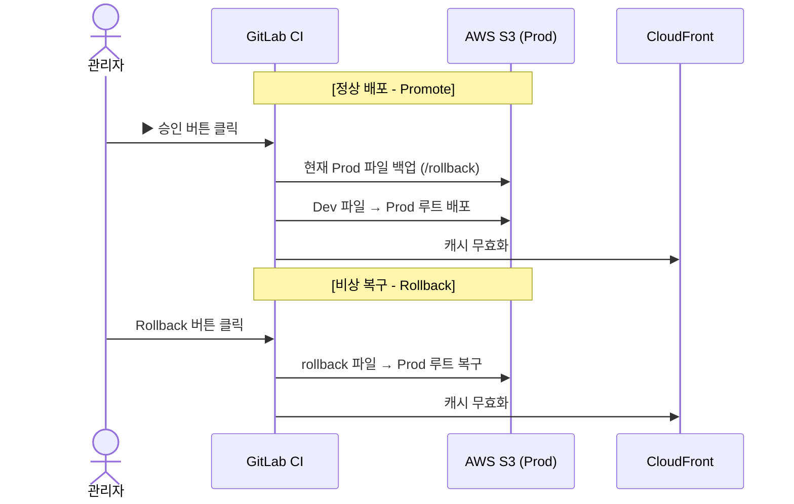

# AWS S3+Gitlab CI/CD

# Zendesk Private App CI/CD 구축 가이드

**(GitLab CI/CD + AWS S3 + CloudFront)**

---

## 1. 개요 (Overview)

이 문서는 **WiseNTalk Zendesk Private App**을

GitLab CI/CD와 AWS 인프라(S3 + CloudFront)를 이용해 **자동 배포**하는 방법을 설명합니다.

### 핵심 목표

- React 기반 정적 웹 앱을 **자동 빌드**
- S3 + CloudFront를 통해 **Dev / Prod 환경 분리 배포**
- Zendesk Iframe App은 **한 번만 설치**
- 이후 코드는 **CI/CD로만 업데이트**
- 운영 중 문제 발생 시 **즉시 롤백 가능**

---

## 2. 아키텍처 개요 (Architecture)

### 배포 전략 요약

| 환경 | 트리거 | 동작 |
| --- | --- | --- |
| **Dev** | `main` 브랜치 push | 자동 빌드 → Dev S3 배포 |
| **Prod** | Pipeline 승인 버튼 | Dev → Prod 승격 |
| **Rollback** | Pipeline 버튼 | 이전 버전 즉시 복구 |

### 전체 흐름 다이어그램



---

## 3. AWS 인프라 설정

### 3.1 S3 버킷 구성

Dev / Prod 용 **S3 버킷을 각각 생성**합니다.

**공통 설정**

- `Block all public access` : **ON**
- 정적 파일 저장용 (`index.html`, `js`, `css` 등)

---

### 3.2 CloudFront 배포 설정

Dev / Prod 각각 CloudFront Distribution 생성

**주요 설정 값**

| 항목 | 값 |
| --- | --- |
| Origin | S3 Bucket |
| Origin access | **Origin Access Control (OAC)** |
| Viewer protocol | Redirect HTTP → HTTPS |
| Default root object | `index.html` |

> ⚠️ 중요
> 
> 
> CloudFront 생성 후 **[Copy policy]** 버튼을 눌러
> 
> S3 Bucket Policy에 반드시 붙여넣어야 합니다.
> 

---

## 4. IAM 권한 설정

GitLab CI가 AWS에 접근하기 위한 **전용 IAM 사용자**를 생성합니다.

### 4.1 IAM Policy

```json
{
  "Version": "2012-10-17",
  "Statement": [
    {
      "Sid": "S3Access",
      "Effect": "Allow",
      "Action": [
        "s3:PutObject",
        "s3:GetObject",
        "s3:ListBucket",
        "s3:DeleteObject"
      ],
      "Resource": "*"
    },
    {
      "Sid": "CloudFrontInvalidation",
      "Effect": "Allow",
      "Action": [
        "cloudfront:CreateInvalidation",
        "cloudfront:GetInvalidation"
      ],
      "Resource": "*"
    }
  ]
}

```

> 생성 후 Access Key / Secret Key를 GitLab 변수로 등록합니다.
> 

---

## 5. GitLab Runner 설정 (Windows Server 기준)

### 5.1 Runner 생성 (GitLab UI)

경로

`Settings → CI/CD → Runners → New Project Runner`

**설정 값**

- Platform: Linux / Windows (환경에 맞게)
- Run untagged jobs: ✅
- Executor: `shell`

---

### 5.2 Runner 설치 & 등록

```bash
sudo gitlab-runner register \
  --url "https://gitlab.com/" \
  --token "YOUR_TOKEN"

```

### 5.3 PowerShell 7 설정 (Windows)

`config.toml`

```toml
[[runners]]
  name = "My-Windows-Runner"
  executor = "shell"
  shell = "pwsh"

```

> 변경 후 반드시
> 
> 
> `Restart-Service gitlab-runner`
> 

---

## 6. GitLab CI/CD 구성

[CI/CD PIPELINE](https://www.notion.so/CI-CD-PIPELINE-2eef8917466a80f2a150f056ac821864?pvs=21)

### 6.1 필수 환경 변수

**GitLab → Settings → CI/CD → Variables**

### AWS

| Key | 설명 |
| --- | --- |
| AWS_ACCESS_KEY_ID | IAM Access Key |
| AWS_SECRET_ACCESS_KEY | IAM Secret |
| AWS_DEFAULT_REGION | 예: ap-northeast-2 |
| DEV_S3_BUCKET | Dev S3 |
| DEV_CF_ID | Dev CloudFront ID |
| PROD_S3_BUCKET | Prod S3 |
| PROD_CF_ID | Prod CloudFront ID |

---

### 6.2 파이프라인 구조 (`.gitlab-ci.yml`)

**Stages**

1. build
2. deploy-dev
3. promote-prod (manual)
4. rollback (manual)

**핵심 특징**

- `GIT_STRATEGY: fetch`
- `CI: "false"` (경고로 인한 빌드 실패 방지)
- 롤백 자동 백업 포함

(※ 실제 YAML은 그대로 유지 가능)

---

## 7. Zendesk 앱 구성 전략 (중요)

### 핵심 원칙

> Zendesk는 앱을 처음 설치할 때의 설정만 기억합니다.
> 
> 
> 이후 S3에 있는 `manifest.json`은 **참고되지 않습니다.**
> 

---

### 7.1 앱 이원화 전략

Zendesk Admin Center에 **앱을 2개 등록**

| 앱 | URL |
| --- | --- |
| Dev App | Dev CloudFront |
| Prod App | Prod CloudFront |

---

### 7.2 manifest.json 관리 원칙

**Git 저장소의 manifest.json**

```json
{
  "name": "WisenTalk Custom",
  "location": {
    "zamine": {
      "url": "https://[PROD_CLOUDFRONT_DOMAIN]/index.html",
      "flexible": true
    }
  }
}

```

- Dev App은 **설치 시점의 URL**을 계속 사용
- CI/CD는 **S3의 코드만 변경**

---

## 8. 동작 시나리오 정리

### Step 1. GitLab CI (AWS 관점)

- build → Dev S3 업로드
- CloudFront 캐시 무효화

### Step 2. Zendesk 실행 (Zendesk 관점)

- Zendesk는 **기존에 설치된 URL**로 iframe 로딩
- S3에 있는 manifest.json은 무시됨
- 결과적으로 **새 코드만 반영**

---

## 9. 트러블슈팅

### pwsh not found

- `shell = "pwsh"` 확인
- Runner 재시작

### Dev 화면 Access Denied

- CloudFront 정책을 S3에 적용했는지 확인

### 빌드 실패

```bash
npm install --legacy-peer-deps
npm run build

```

---

## 10. 프로젝트 구조

```
WisenTalk/
├── .gitlab-ci.yml
├── package.json
├── src/
├── build/
├── zendesk-private-app-dev/
│   ├── manifest.json
│   ├── assets/
│   ├── translations/
│   └── zcli.apps.config.json

```

---

## 요약

- Zendesk App은 **한 번만 설치**
- 배포는 **S3 + CloudFront**
- CI/CD는 **코드만 교체**
- App ID 변경 없음
- 롤백 즉시 가능

---